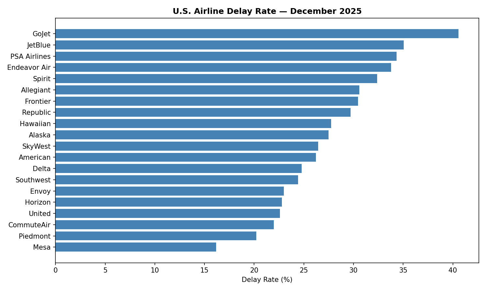

# U.S. Airline Delay Analysis

## Overview
Analyzes U.S. airline on-time performance data from the Bureau of Transportation Statistics (BTS) to identify delay trends by airline, cause, and airport using a full data pipeline: cleaning, SQL querying, and visualization.

## Dataset
Source: https://www.transtats.bts.gov/OT_Delay/OT_DelayCause1.asp  
Download the CSV, place it in the same folder as the scripts, and name it: airline_delay_data.csv

## Project Structure
| File | Description |
|------|-------------|
| airline_delay_analysis.py | Loads, cleans, and analyzes the raw CSV using pandas |
| load_to_sql.py | Loads cleaned data into a SQLite database |
| sql_queries.py | Runs SQL queries and exports results to CSV |
| visualizations.py | Generates bar chart of delay rates by airline |
| chart_delay_by_airline.png | Output chart |

## What the pipeline does
1. Cleans 1,800+ records, handles missing values and type mismatches
2. Loads data into SQLite and queries it using SQL
3. Aggregates delays by airline, cause, and airport
4. Visualizes results as a chart

## Key Findings (December 2025)
- GoJet Airlines had the highest delay rate at 40.6%
- Late aircraft was the #1 delay cause at 43% of total delay minutes
- Carrier-caused delays accounted for 33% of total delay minutes
- Weather was responsible for only 6.5% of delays

## Chart

## How I ran it 
1. pip install pandas matplotlib
2. Place airline_delay_data.csv in the same folder
3. Run in order:
   - python airline_delay_analysis.py
   - python load_to_sql.py
   - python sql_queries.py
   - python visualizations.py

## Tools Used
Python, pandas, SQLite, SQL, matplotlib, Excel
